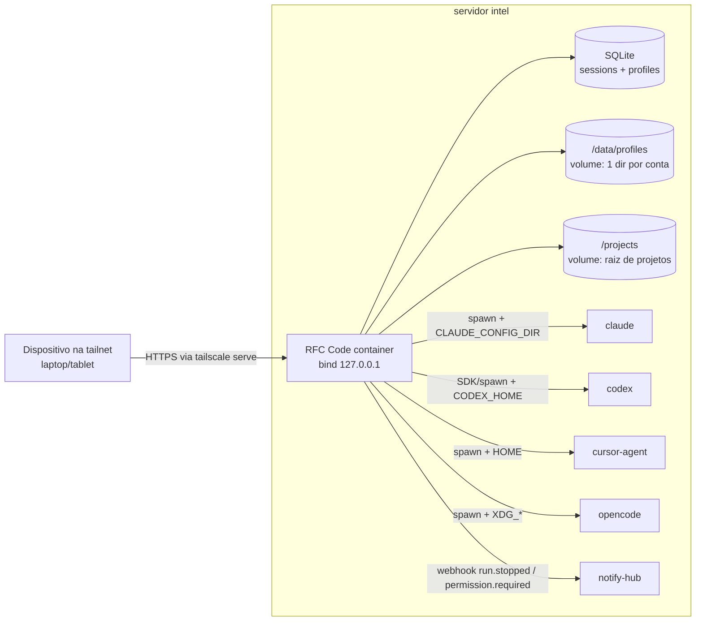

# RFC Code MVP Design

**Spec**: `.specs/features/mvp-web-harness/spec.md`
**Status**: Approved (2026-07-23, com adendos do usuário: híbrido Node+sidecar futuro; handoff HUB-12; collab → feature 2)
**Base verificada**: fork de siteboon/claudecodeui = **CloudCLI v1.36.3** (verificação por evidência em 2026-07-23, clone no scratchpad)

---

## Resultado da verificação (resumo)

O upstream já entrega **7 de 11 requisitos PRONTOS**:

| Req | Status | Evidência-chave |
| --- | --- | --- |
| HUB-02 tablet | ✅ PRONTO | 60 componentes c/ breakpoints, `isMobile`, PWA + SW |
| HUB-03 sessão Claude streaming+permissões | ✅ PRONTO | `server/claude-sdk.js` (Agent SDK, `canUseTool` :528) + `PermissionRequestsBanner.tsx` |
| HUB-04 resume/persistência | ✅ PRONTO* | SQLite `sessions` (`schema.ts:99`) + synchronizers lendo artefatos dos CLIs; *run ativo é in-memory (restart → retomável, não contínuo) — aceito pelo spec |
| HUB-06 multi-agent | ✅ PRONTO | `provider.registry.ts:9-14`: Claude (Agent SDK), Codex (`@openai/codex-sdk`), Cursor (spawn `cursor-agent`), OpenCode (spawn `opencode run`) |
| HUB-08 MCP/skills UI | ✅ PRONTO | `McpServers.tsx` + `mcp.service.ts` + `ProviderSkills.tsx`, pros 4 agents |
| HUB-11 terminal/editor/git | ✅ PRONTO | xterm+node-pty, CodeMirror, git-panel completo |
| HUB-01 acesso sem login | 🟡 PARCIAL | `IS_PLATFORM` desliga auth mas é flag build-time + exige user no DB |
| HUB-07 Docker | 🟡 PARCIAL | Só templates `sbx` (microVM); sem compose self-hosted que instale os 4 CLIs |
| HUB-09 notificações | 🟡 PARCIAL | Orchestrator de eventos c/ registry de canais plugável (`notification-orchestrator.service.js:209`); falta canal webhook |
| **HUB-05 perfis multi-conta** | ❌ **AUSENTE** | Config dirs hardcoded em `os.homedir()`; é O trabalho custom |

Permissões interativas hoje são só do Claude; Codex/Cursor/OpenCode rodam bypass (limitação upstream aceita no MVP — HUB-06 AC2 "equivalentes" = melhor esforço do CLI).

---

## Abordagens para HUB-05 (perfis multi-conta)

### A) Env-injection por sessão, container único ⭐ RECOMENDADA

Perfil = diretório isolado em volume (`/data/profiles/<provider>/<slug>`). Ao iniciar sessão, o backend injeta no processo-filho do CLI o env que redireciona a config:

| Provider | Injeção | Ponto exato |
| --- | --- | --- |
| Claude | `CLAUDE_CONFIG_DIR` | `server/claude-sdk.js:167` (`sdkOptions.env` — SDK repassa ao binário) |
| Cursor | `HOME` (ou var dedicada, verificar) | `server/cursor-cli.js:138` |
| OpenCode | `XDG_CONFIG_HOME` + `XDG_DATA_HOME` | `server/opencode-cli.js:271` |
| Codex | `CODEX_HOME` — ⚠️ SDK in-process; verificar se aceita env; fallback: spawn direto do CLI `codex` (copiar padrão do `cursor-cli.js`) | `server/openai-codex.js:260` |

- **Prós**: 1 container, deploy trivial, troca de perfil = escolha na criação da sessão, N perfis sem custo de infra, sessões paralelas com perfis distintos.
- **Contras**: Codex exige verificação/fallback; synchronizers precisam virar profile-aware.

### B) Container por perfil (compose service por conta)

- **Prós**: isolamento máximo (nível kernel).
- **Contras**: N containers, UI teria que rotear entre N backends (refactor grande do CloudCLI), troca de perfil pesada, recursos desperdiçados. Overkill para single-user.

### C) HOME-override total por perfil

Sobrescrever `HOME` do processo-filho para todos os providers (1 mecanismo só).

- **Prós**: uniforme, pega qualquer CLI futuro.
- **Contras**: quebra o que depende do HOME real (gitconfig, ssh keys) exigindo bind-mounts extras por perfil; menos cirúrgico que A.

**Recomendação: A** — usa o mecanismo nativo de cada CLI (Claude tem suporte de 1ª classe), diff mínimo vs upstream (facilita merges futuros), e C fica como fallback pontual se algum CLI não tiver var dedicada.

---

## Architecture Overview



## Code Reuse Analysis

| Component | Location (upstream) | How to Use |
| --- | --- | --- |
| Provider registry (7 facetas/provider) | `server/modules/providers/` | Espelhar padrão p/ novo módulo `profiles` |
| Dispatch de sessão (WS + SSE) | `server/index.js:112-117`, `server/routes/agent.js:956-1000` | Adicionar campo `profileId` ao options |
| Notification orchestrator | `server/modules/notifications/.../notification-orchestrator.service.js:209-222` | Adicionar canal `webhook` ao array |
| Schema/migrations SQLite | `server/modules/database/schema.ts` | Tabela `profiles` + coluna `profile_id` em `sessions` |
| Shell WS (terminal web) | `.../shell-websocket.service.ts` | Reusar p/ login guiado: terminal com env do perfil pré-setado (`claude /login` etc.) |
| Auth middleware | `server/middleware/auth.js` | Patch: modo `AUTH_MODE=trusted` runtime |
| Seletor de provider na UI | `src/components/chat/hooks/useChatProviderState.ts`, `ProviderSelectionEmptyState.tsx` | Estender com dropdown de perfil |
| Docker templates | `docker/` (referência apenas) | Escrever `deploy/Dockerfile` + `compose` próprios |

## Components

### profiles module (novo)
- **Purpose**: CRUD de perfis + resolução de env por provider.
- **Location**: `server/modules/profiles/` (padrão dos módulos upstream)
- **Interfaces**: `createProfile(provider, name)`, `listProfiles(provider?)`, `deleteProfile(id)`, `resolveEnv(profileId): Record<string,string>`, `getAuthStatus(profileId)`
- **Reuses**: schema.ts (migration), padrão de rotas de `provider.routes.ts`

### env-injection patches (upstream, cirúrgico)
- **Purpose**: aplicar `resolveEnv(profileId)` no spawn de cada CLI.
- **Location**: `claude-sdk.js:167`, `cursor-cli.js:138`, `opencode-cli.js:271`, `openai-codex.js:260`, + dispatch (`index.js:112`, `agent.js:956`)
- **Nota**: Codex — 1ª task de execute VERIFICA se `@openai/codex-sdk` aceita env/`CODEX_HOME`; senão, fallback spawn direto.

### profile-aware session sync (patch)
- **Purpose**: synchronizers varrem roots por perfil (não só `~`); sessão gravada com `profile_id` → badge na UI "qual conta está em uso" (HUB-05 AC2).
- **Location**: `server/modules/providers/list/*/​*-session-synchronizer.provider.ts`

### auth trusted mode (patch)
- **Purpose**: `AUTH_MODE=trusted` (runtime, não build-time): pula JWT no HTTP e WS, auto-seed de user no boot. Guard: recusa subir se bind ≠ 127.0.0.1/tailnet.
- **Location**: `server/middleware/auth.js`, `server/index.js` (boot)

### profile auth UI (novo)
- **Purpose**: página de perfis com status (autenticado/expirado) + botão "autenticar" que abre o terminal web já com env do perfil (login OAuth interativo 1x, resolve o problema de headless).
- **Location**: `src/components/profiles/` (novo), reusa shell WS

### notify-hub webhook channel (novo, ~1 objeto)
- **Purpose**: POST pra notify-hub em `run.stopped`, `run.failed`, `permission.required` (>60s pendente).
- **Location**: registro no `notification-orchestrator.service.js:209`; URL/token via env do container

### session-handoff service (novo — HUB-12)
- **Purpose**: trocar o perfil de uma sessão entre turnos preservando contexto. Mecânica: transplantar o artefato de sessão do provider entre config dirs (Claude: `<config>/projects/<slug>/<session-id>.jsonl`; Codex: `<CODEX_HOME>/sessions/...`) e resumir com o novo perfil. Degradação: nova sessão semeada com o transcript.
- **Location**: `server/modules/profiles/handoff.service.ts` (novo); UI: ação "trocar conta" no header da sessão
- **Risco**: portabilidade dos session files entre config dirs não é documentada — spike de verificação é a 1ª task deste componente
- **Reuses**: resume nativo de cada provider (`claude-sdk.js:229`, `openai-codex.js:272`)

### deploy (novo)
- **Purpose**: `deploy/Dockerfile` (node:22 + `npm i -g` claude/codex/opencode + binário cursor-agent + build do app) e `deploy/docker-compose.yml` (volumes: `/projects`, `/data` [db+profiles]; bind `127.0.0.1`; restart policy). Exposição: `tailscale serve` no host intel → `https://rfc-code.<tailnet>.ts.net`.
- **Location**: `deploy/` (dir novo, fora do upstream — zero conflito de merge)

## Data Models

```typescript
interface Profile {
  id: string            // uuid
  provider: 'claude' | 'codex' | 'cursor' | 'opencode'
  name: string          // "Claude Max — Richard A"
  slug: string          // dir: /data/profiles/<provider>/<slug>
  createdAt: Date
}
// sessions: + profile_id (nullable p/ sessões pré-feature)
```

## Error Handling Strategy

| Error Scenario | Handling | User Impact |
| --- | --- | --- |
| Perfil sem credenciais / token expirado | `getAuthStatus` detecta → sessão bloqueada na criação | Badge "re-autenticar" + botão p/ terminal de login |
| Codex SDK não aceitar env | Fallback spawn CLI (task específica) | Nenhum (transparente) |
| `AUTH_MODE=trusted` com bind público | Guard no boot recusa subir | Erro claro no log do container |
| CLI ausente na imagem | Provider marcado indisponível no registry | Seletor mostra "indisponível + motivo" (HUB-06 AC3/AC4) |
| notify-hub fora do ar | Canal webhook loga e segue (fire-and-forget, timeout 5s) | Sem push; sessão não afetada |

## Risks & Concerns

| Concern | Location | Impact | Mitigation |
| --- | --- | --- | --- |
| Codex SDK in-process (env global) | `server/openai-codex.js:260` | Perfis Codex podem vazar entre sessões concorrentes | **RESOLVIDO — T7 spike (evidência: `@openai/codex-sdk` 0.144.1, código-fonte openai/codex `sdk/typescript/src/{codexOptions,codex,exec}.ts`).** `CodexOptions.env?: Record<string,string>` ("passed to the Codex CLI process; when provided, the SDK will **not** inherit variables from process.env"). Cadeia: `new Codex({env})` → `new CodexExec(path, env, config)` guarda `this.envOverride`; `CodexExec.run()` monta env por invocação e faz `spawn(exe, args, { env, signal })` (child_process real). "No singleton or static state is shared across instances." Como `queryCodex` faz `new Codex()` **por chamada**, 2 sessões concorrentes = 2 CodexExec independentes = isolamento total. **SEM fallback de spawn direto.** Cuidado: como o SDK não herda `process.env`, injetar `{ ...process.env, CODEX_HOME }` (não só CODEX_HOME) — feito em `server/codex-client-options.js`. |
| Arquivos gigantes no upstream | `server/index.js` (1651 ln), `routes/git.js`, `routes/agent.js` | Patches nossos em arquivos quentes → conflitos de merge | Patches mínimos e pontuais; lógica nova SEMPRE em módulos novos |
| Testes existem mas sem script `test` nem CI | `package.json`, `.github/workflows` | Gate de qualidade não roda | Adicionar script `test` (node:test) — nossos testes rodam no gate de cada task |
| Auth off é build-time (`VITE_IS_PLATFORM`) | `src/utils/api.js:25` | Rebuild pra alternar auth | Patch `AUTH_MODE=trusted` runtime (server) + build único com flag |
| AGPL-3.0 + Seção 7 custom | `LICENSE:668-695` | Obrigação legal | Manter atribuição "CloudCLI UI" no README; fork público; sem uso das marcas |
| Upstream ativo (rebrand CloudCLI) | — | Drift rápido do fork | Branch `main` espelha upstream; nosso trabalho em `rfc-code`; merges mensais |
| `taskmaster` (46K) e extras não usados | `server/routes/taskmaster.js` | Peso morto | NÃO podar (minimiza conflitos); ocultar na UI se incomodar |

## Tech Decisions (only non-obvious ones)

| Decision | Choice | Rationale |
| --- | --- | --- |
| Isolamento de perfil | Env-injection por sessão (abordagem A) | Mecanismo nativo dos CLIs, diff mínimo, single container |
| Login das contas | 1x via terminal web com env do perfil | Resolve OAuth headless sem gambiarra; tokens long-lived persistem no volume |
| Exposição de rede | `tailscale serve` no host + bind 127.0.0.1 | Zero porta pública, HTTPS/MagicDNS grátis, app fica simples |
| Estratégia de fork | `main` = upstream, branch `rfc-code` = nosso; código novo em módulos novos | Merges upstream baratos |
| Não podar código upstream | Manter taskmaster etc. | Cada poda = conflito eterno de merge |
| Linguagem (política) | Fork permanece Node/TS; CPU-bound futuro = sidecar Rust/Go (AD-010) | SDKs Claude/Codex são TS-nativos; app é I/O-bound; sidecar só quando houver carga real |
| Handoff entre contas | Transplante de session file + resume; degradação = nova sessão semeada | Usa resume nativo; evita reimplementar histórico; spike valida portabilidade |
