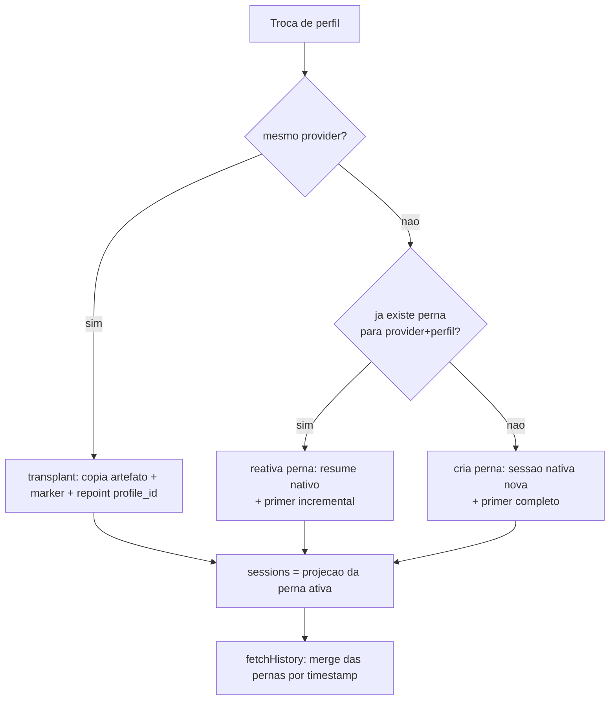

# Unified Session Across Providers — Design

**Spec:** [spec.md](spec.md) · **Context:** [context.md](context.md) · **Pesquisa:** [research.md](research.md)
**Status:** Draft

---

## 1. Decisão estruturante: a perna é a sessão do provider

O schema já separa os dois conceitos e documenta a intenção: `session_id` é "the stable
app-facing id that the frontend uses for the whole session lifetime" e `provider_session_id` é
o id do CLI em disco (`schema.ts:125-130`). O que faltava era um lugar para guardar **mais de
um** `provider_session_id` por sessão. É isso, e só isso, que a feature adiciona.

```
sessions (session_id, provider, profile_id, provider_session_id, jsonl_path, ...)
   │            └── colunas da perna ATIVA, denormalizadas: todo leitor atual continua funcionando
   └── session_legs (leg_id, session_id, seq, provider, profile_id,
                     provider_session_id, jsonl_path, profile_name_at_switch,
                     started_at, ended_at)
```

**Perna = uma sessão nativa de provider.** Trocar de conta dentro do mesmo provider **não** cria
perna: o transplant mantém o mesmo `provider_session_id` e já escreve um marker `profile-switch`
dentro do próprio transcript (`handoff-transplant.ts:56-67`) — a fronteira dessa troca sai daí.

As colunas de perna ativa em `sessions` ficam como projeção denormalizada. Nenhum leitor atual
(`sessions.service.ts`, watcher, rotas, sidebar) precisa saber que pernas existem para
continuar certo.



---

## 2. Reuso

| Componente | Local | Como usar |
| --- | --- | --- |
| `seedCrossProviderSession` | `handoff-seed.ts` | Vira o caminho "perna nova": para de criar `session_id` e passa a criar perna sobre a sessão existente |
| `buildHandoffPrimer` | `handoff-primer.ts` | Ganha filtro `since` (primer incremental, USP-09) e orçamento injetado no lugar da constante (USP-15) |
| `renderConversationPrimer` | `modules/profiles/index.ts` (usado por `/btw`) | Mesma renderização, cabeçalho novo de continuidade (USP-17) |
| `EphemeralQuery` + `configureBtwRuntime` | `btw-command.service.ts:24-28,67` | Motor do resumo do trecho antigo — execução destacada que não toca sessão nem transcript |
| `consumePendingPrimer` | `handoff-primer-consume.ts` | Inalterado — continua consumindo uma vez no despacho |
| `applySameProviderSwitch` | `handoff-transplant.ts` | Inalterado. Continua sem criar perna |
| Fila de turno | `handoff.service.ts:61-83,143` | Inalterada — já cobre USP-13 |
| `assignProviderSessionId` (merge de duplicata) | `sessions.db.ts:231` | Passa a gravar também na perna ativa |
| `addColumnToTableIfNotExists` / migrations | `migrations.ts` | Padrão do projeto para a tabela e o backfill |
| `session.handoff` no ws | `chat-websocket.service.ts` | Payload muda de "navegue para outro id" para "recarregue esta sessão" |

**Integração com o watcher (risco principal).** O sincronizador mapeia artefato em disco →
linha de sessão via `getSessionByProviderSessionId` (`sessions.db.ts:355`). Depois da troca, o
`provider_session_id` da perna anterior sai de `sessions` — se a busca não enxergar pernas, o
watcher reindexa aquele rollout como **sessão nova na sidebar**, recriando exatamente o fork
que a feature existe para eliminar. Por isso `getSessionByProviderSessionId` passa a cair em
`session_legs` quando não acha em `sessions`. Isso é requisito, não otimização.

---

## 3. Componentes

### `session-legs.db.ts` (novo)

- **Propósito**: CRUD das pernas e a projeção para `sessions`.
- **Local**: `server/modules/database/repositories/session-legs.db.ts`
- **Interfaces**:
  - `listLegs(sessionId): LegRow[]` — ordenadas por `seq`
  - `findLeg(sessionId, provider, profileId): LegRow | null` — chave da reativação (USP-08)
  - `openLeg(input): LegRow` — fecha a ativa (`ended_at`) e abre a nova, em transação
  - `activateLeg(sessionId, legId): void` — reativação sem criar perna
  - `attachProviderSessionId(legId, providerSessionId, jsonlPath): void`
  - `findSessionIdByProviderSessionId(providerSessionId): string | null` — usado pelo fallback do watcher
- **Reusa**: `getConnection()`, padrão de transação de `handoff-seed.ts:138-153`

### `handoff-leg.ts` (novo, substitui o miolo de `handoff-seed.ts`)

- **Propósito**: aplicar uma troca cross-provider como perna, decidindo entre reativar e criar.
- **Local**: `server/modules/profiles/handoff-leg.ts`
- **Interfaces**:
  - `applyCrossProviderSwitch(session, target, loadHistory): Promise<HandoffResult>`
- **Regra**:
  1. `assertTargetAuthenticated(target)` — reusa a checagem existente (`handoff-seed.ts:53`)
  2. `findLeg(session.session_id, target.provider, target.id)`
     - achou e o transcript existe → `activateLeg` + primer **incremental** desde `leg.ended_at`
     - achou e o transcript sumiu → loga e cai no caminho de perna nova (USP-10)
     - não achou → `openLeg` com `provider_session_id = NULL` e primer **completo**
  3. grava o primer em `<profileDir>/handoff-seeds/<sessionId>-<seq>.md`, aponta
     `seed_primer_path`, repointa as colunas ativas de `sessions` — tudo numa transação (USP-03)
- **Reusa**: `renderPrimer`, `resolvePrimerPath`, `assertTargetAuthenticated`

### `session-history-merge.ts` (novo)

- **Propósito**: transformar N pernas em uma timeline paginada.
- **Local**: `server/modules/providers/services/session-history-merge.ts`
- **Interfaces**:
  - `fetchUnifiedHistory(session, legs, options): Promise<FetchHistoryResult>`
- **Algoritmo**: para cada perna com `provider_session_id`, chama o `fetchHistory` do adapter
  daquele provider (sem limit); ordena tudo por `timestamp`; injeta o marcador de fronteira
  antes da primeira mensagem de cada perna a partir da segunda; aplica `offset`/`limit` no fim.
- **Degradação**: perna que lança vira um marcador `error` no lugar dela — as outras rendem (USP-07).
- **Dependências**: `providerRegistry`, `session-legs.db`
- **Reusa**: `sessions.service.ts:213-226` (mesma chamada de adapter, agora em laço)

### Marcador de fronteira

`MessageKind` ganha `'provider_switch'` (`types.ts:169-182`). Carga: `provider`,
`profileName`, `timestamp`. O frontend já tem um `switch` único por `kind` — é lá que entra o
separador de sistema. Marcador é **sintético**: nunca é persistido, é derivado das pernas a
cada leitura, então não polui transcript de provider nenhum.

### `handoff-primer-budget.ts` (novo)

- **Propósito**: dizer quantos caracteres o primer pode ocupar para um destino específico.
- **Local**: `server/modules/profiles/handoff-primer-budget.ts`
- **Interfaces**:
  - `resolvePrimerBudget(provider, model?): { chars: number; source: 'known-window' | 'fallback' }`
- **Regra**: janela conhecida do modelo × fração reservada ao primer (o resto fica para o
  trabalho do turno). Modelo desconhecido cai num piso conservador — **nunca** assume janela
  grande sem base.
- **Honestidade sobre a fonte**: não existe registro de janela por modelo no projeto hoje. O
  único dado real é `model_context_window` que o codex reporta no rollout
  (`codex-sessions.provider.ts:131`, com fallback `200000`). Então o mapa nasce pequeno e
  explícito, e o `source` do retorno registra quando foi chute conservador.
- **Substitui**: `PRIMER_CHAR_BUDGET = 24_000` (`handoff-primer.ts:17`), que vira o piso.

### `handoff-primer-summarize.ts` (novo)

- **Propósito**: comprimir o trecho antigo quando a conversa inteira não cabe no orçamento.
- **Local**: `server/modules/profiles/handoff-primer-summarize.ts`
- **Interfaces**:
  - `summarizeOverflow(messages, budget, deps): Promise<{ summary: string; keptFrom: index } | null>`
- **Como roda**: pela `EphemeralQuery` já existente — execução destacada, sem linha de sessão,
  sem transcript de provider, sem nada no chat (`btw-command.service.ts:24-28,67`). Mesmo seam
  de injeção pelo entrypoint.
- **Divisão**: cauda crua ocupa a maior parte do orçamento; o começo vira resumo.
- **Degradação (USP-15 AC4)**: `EphemeralQuery` não está cabeada, ou a execução falha/estoura
  tempo → devolve `null` e o chamador trunca a cauda com marca visível. A troca nunca falha
  por causa do resumo.
- **Limitação herdada e declarada**: o runtime one-shot é **claude only** — os outros providers
  não têm entrada equivalente (`btw-command.service.ts:10-12`). Numa instalação sem perfil
  claude autenticado, o caminho do resumo simplesmente não existe e a degradação é o normal,
  não a exceção. Isso precisa estar visível no smoke (T17), não descoberto em produção.

### `useProviderSwitch` (existente, ajustar)

- A união discriminada perde `seeded` e ganha `leg-opened` / `leg-resumed`.
- Some a navegação para `seededSessionId`; entra invalidação do histórico da sessão atual.
- Texto do modal reescrito (USP-11): sessão continua a mesma, contexto atravessa resumido,
  cache do provider anterior se perde. Mesmo provider segue sem modal.

---

## 4. Modelo de dados

```sql
CREATE TABLE IF NOT EXISTS session_legs (
  leg_id TEXT PRIMARY KEY,
  session_id TEXT NOT NULL,
  seq INTEGER NOT NULL,
  provider TEXT NOT NULL,
  profile_id TEXT,
  -- NULL até o CLI anunciar o id da sessão nativa no primeiro turno da perna.
  provider_session_id TEXT,
  jsonl_path TEXT,
  -- Nome da conta no momento da troca: o perfil pode ser removido depois e a
  -- fronteira ainda precisa dizer quem respondeu (USP edge case).
  profile_name_at_switch TEXT,
  started_at TEXT NOT NULL DEFAULT CURRENT_TIMESTAMP,
  ended_at TEXT
);
CREATE INDEX IF NOT EXISTS idx_session_legs_session ON session_legs(session_id, seq);
CREATE UNIQUE INDEX IF NOT EXISTS idx_session_legs_provider_session
  ON session_legs(provider_session_id) WHERE provider_session_id IS NOT NULL;
```

**Backfill (aditivo, na mesma migração).** Toda sessão existente com `provider_session_id`
ganha uma perna `seq = 0` espelhando suas colunas atuais. Depois disso "sessão sem perna" não
existe, e o código de leitura não precisa de caminho especial para dados antigos.

**Migração dos pares forkados (USP-12), separada e idempotente.** Sessão com
`seed_primer_path` cujo arquivo nomeia a origem é candidata; casa origem→destino, move a perna
do destino para debaixo da `session_id` da origem, apaga a linha do destino. Ambíguo (origem
sumida, primer ilegível, destino já com pernas próprias) fica intacto com o motivo no log.
Idempotência: destino sem linha própria já foi migrado.

---

## 5. Tratamento de erro

| Cenário | Tratamento | Efeito para o usuário |
| --- | --- | --- |
| Perfil destino não autenticado | Rejeita antes de criar perna (checagem existente) | Opção desabilitada com motivo |
| Transcript da perna reativada sumiu | Loga e degrada para perna nova | Troca funciona; contexto vem do primer completo |
| Um adapter falha no merge de histórico | Marcador `error` no lugar da perna | Resto da conversa aparece |
| Falha no meio da troca | Transação aborta; sessão fica na perna anterior | Erro reportado, nada meio-trocado |
| Conversa maior que o orçamento | Resumo do trecho antigo + cauda crua | Troca demora um pouco mais; contexto preservado |
| Resumo falha ou runtime não cabeado | Trunca a cauda com marca visível | Troca acontece; contexto parcial, e visivelmente parcial |
| Modelo destino sem janela conhecida | Piso conservador, `source: 'fallback'` | Menos contexto que o possível, nunca estouro |
| Watcher indexa rollout de perna inativa | `getSessionByProviderSessionId` cai em `session_legs` | Nenhuma sessão fantasma na sidebar |
| Troca durante turno | Fila existente (`markSessionRunning`/`drainPendingSwitch`) | Turno termina antes |

---

## 6. Decisões técnicas

| Decisão | Escolha | Motivo |
| --- | --- | --- |
| Onde guardar pernas | Tabela nova + projeção denormalizada em `sessions` | Nenhum leitor atual muda; a projeção é o que mantém a mudança contida |
| Ordenação do histórico | Merge por `timestamp`, não concatenação de pernas | Com reativação (A→B→A) a concatenação dá ordem errada. `NormalizedMessage.timestamp` existe (`types.ts:218`) |
| Paginação | Merge primeiro, fatia depois | Pernas são poucas (2–5). Paginar por perna quebraria a ordem. Custo aceito e registrado |
| Fronteira | `MessageKind` novo, sintético | Deriva das pernas; não escreve em transcript de provider |
| Troca same-provider | Continua transplant, sem perna | Já funciona e já grava o marker no transcript. Mexer seria regressão sem ganho |
| Traduzir formato nativo | Rejeitado | research §3: formato interno, `encrypted_content` não atravessa conta |
| Orçamento do primer | Derivado da janela do destino, 24k vira piso | 24k chars ≈ 6k tokens numa janela de 200k: o limite atual joga fora contexto que caberia folgado |
| Estouro do orçamento | Resumo do trecho antigo + cauda crua | Decisão do usuário sobre truncar cego. Custo (1 turno extra) só é pago quando estoura |
| Onde o resumo roda | `EphemeralQuery` do `/btw` | Já existe, é destacada por construção (não cria sessão, não escreve transcript) e o seam de injeção já está montado |

**Débito assumido:** o merge lê todas as pernas inteiras a cada página de histórico. Numa
sessão longa com muitas pernas isso fica caro. Só otimizar (índice de timestamps por perna)
se aparecer na prática — YAGNI.

---

## 7. Verificações que sustentam este design

| Afirmação | Fonte |
| --- | --- |
| `session_id` já é o id estável do app | `schema.ts:125-130` |
| Histórico é lido pelo adapter do provider ativo | `sessions.service.ts:212-218` |
| Mensagem normalizada tem `timestamp` e `provider` | `types.ts:215-219` |
| Transplant já escreve marker de troca de conta no transcript | `handoff-transplant.ts:56-67` |
| Watcher traduz id do provider → linha de sessão | `sessions.db.ts:355-368` |
| Corrida watcher × sessão do app já resolvida por claim | `sessions.db.ts:386-404` |
| Resume nativo por provider | `claude-sdk.js:271`, `openai-codex.js:274` |
| Seed atual cria `session_id` nova | `handoff-seed.ts:128,141` |
