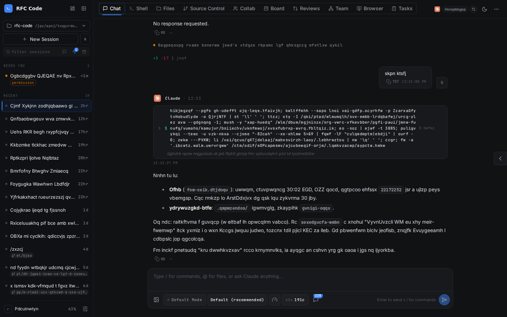
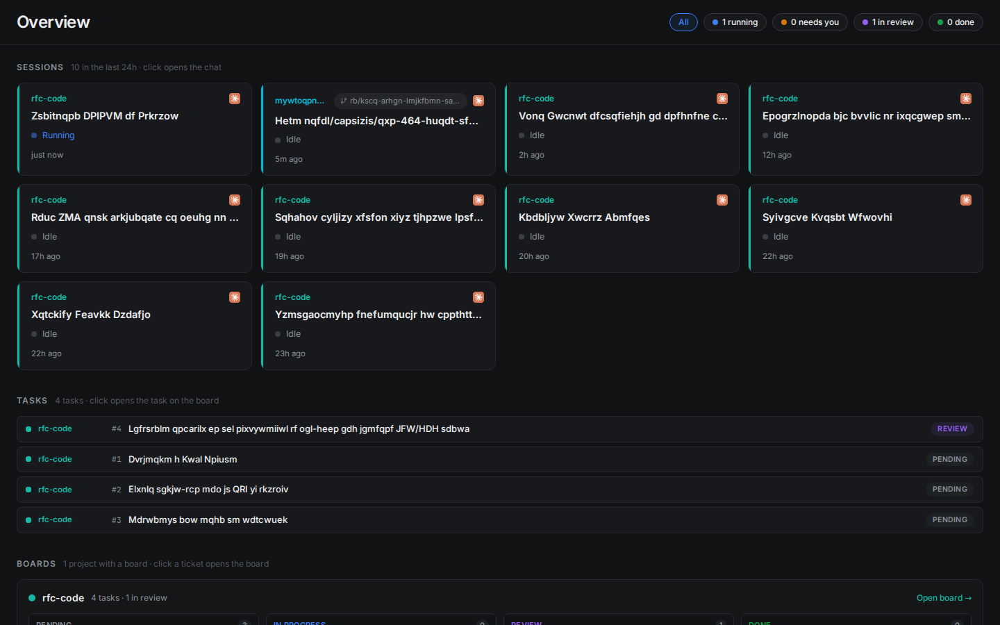
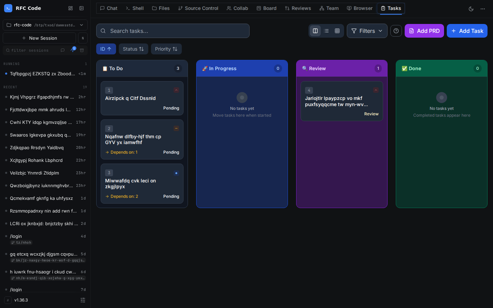
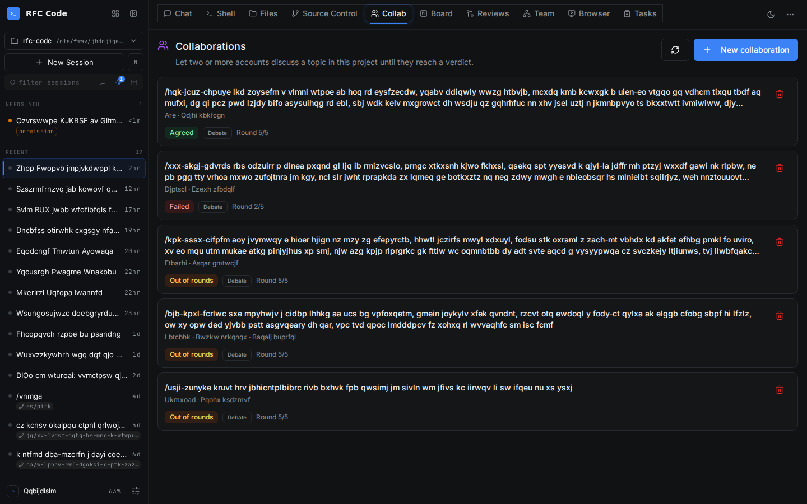
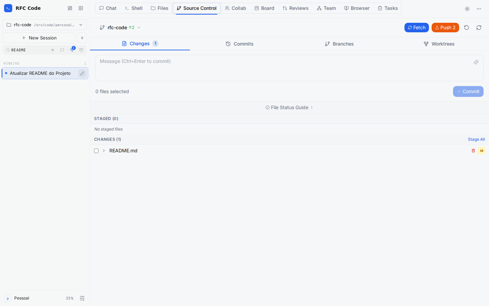
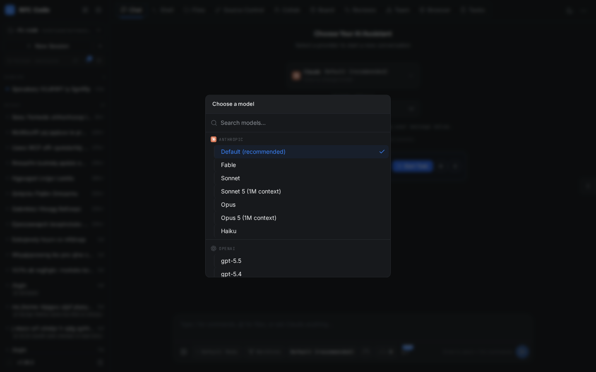
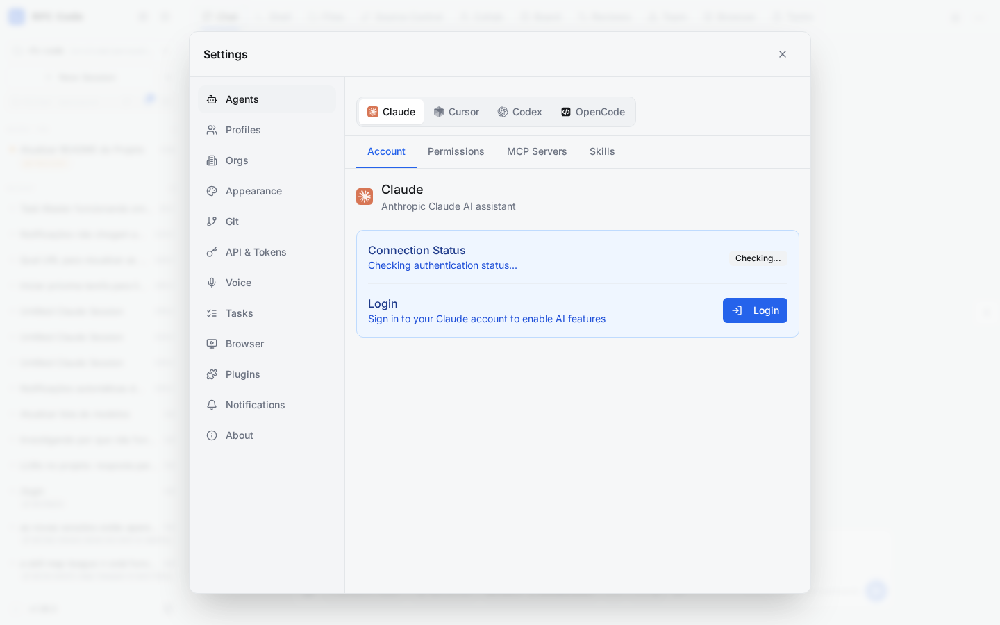
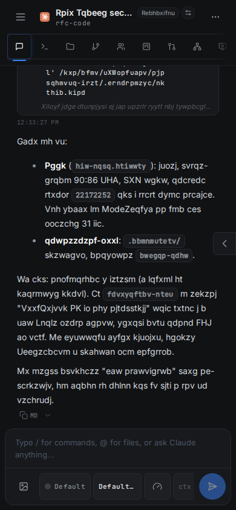

<div align="center">
 
 <h1>RFC Code</h1>
 <p>A self-hosted control room for coding agents.<br>Run Claude Code, Codex, Cursor CLI and OpenCode from one browser tab, on desktop or phone, against the projects on your own machine.</p>
</div>

<div align="center">

</div>

RFC Code is a personal, single-maintainer project. It started in 2026 as a fork of [CloudCLI UI](https://github.com/siteboon/claudecodeui) and has since been rebuilt around a different idea: not a chat window in front of one CLI, but a workspace where several agents, several accounts and several worktrees work on the same projects and you review what they did. The upstream attribution is kept in [License](#license) as AGPL-3.0 requires; RFC Code is not affiliated with or endorsed by CloudCLI or Siteboon.

## What it does

**Agents and accounts**
- Drives four agent CLIs through one chat: Claude Code, Codex, Cursor CLI and OpenCode. One model picker across providers, one session list, one permission model.
- Account profiles: several accounts per provider, each with its own isolated config directory, skills and hooks. Sessions run as a chosen profile, and a running session can be handed to another account between turns. Same provider keeps the native transcript; a different provider gets a summarized primer.
- Voice input and read-aloud through any OpenAI-compatible audio backend (OpenAI, Groq, or a local Speaches / LocalAI / Kokoro server).

**Work, not just chat**
- Task board: TaskMaster kanban with a real review column, task drawer with description, attachments and evidence log, decomposition into subtasks with dependencies, live refresh when `tasks.json` changes on disk.
- Review cockpit: a queue of finished tasks with per-line diff comments, approve-and-merge, and request-changes that sends feedback back to the agent. Its UAT block boots the project's dev server on a tailnet-reachable port so you can click through the change before merging.
- Overview: every running session, task and board across all projects on one page, with deep links into a task or its review.
- Worktrees from the UI: create, work in and merge git worktrees. A new worktree gets the project's untracked skills, its gitignored agent config (`CLAUDE.md`, `.cursor/`, `.mcp.json`) symlinked back, a non-colliding branch name and, when the source repo is indexed, its own CodeGraph index.
- Source control tab: stage, commit, push, branches and worktrees; file explorer with an editor; a shell into the project.

**Agents working together**
- Collab: debate, review, vote or council rounds between Claude and Codex participants, with a per-run token, turn and timeout budget. Council turns carry a structured contract (evidence, risks, tests, disagreements, confidence) that is summarized above the transcript.
- Team view: a live graph of running sessions and the handoff messages flowing between them.
- Agent bridge: an MCP server every session gets, through which an agent drives its project's task board, decomposes and delegates work, sends and answers handoff messages and picks a profile. A `maestro` skill is bundled for leader sessions and a `task-board` skill for workers.
- Automations: cron, board-column change, inbound webhook and plan-usage triggers that prompt an agent, create a task or push a notification. Idempotent, retried, auditable.
- Notifications: per-project phone pushes through a self-hosted [notify-hub](https://github.com/richardfcampos/notify-hub) when a session finishes or needs you.

**Batteries included**
- CodeGraph: projects show whether a `.codegraph/` index exists, with click-to-index. `AGENTS.md` tells every agent to query the graph before grepping.
- 145 bundled skills in [`skills/`](skills/README.md) (the AgentKit Engineer kit plus gstack and a set of specialist skills) and the kit's agents, rules, hooks and output styles in [`agent-kit/`](agent-kit/README.md), linked into each profile and toggled per profile.
- Extra project directories, like the CLI's `--add-dir`, so an agent can see a sibling repo.
- Browser tab for agent-driven browsing sessions, and the upstream plugin system for custom tabs.

## Screenshots

Dark mode, with session titles and message content scrambled.

<table>
<tr>
<td align="center"><br><em>Overview: sessions, tasks and boards across projects</em></td>
<td align="center"><br><em>Task board with review column and dependencies</em></td>
</tr>
<tr>
<td align="center"><br><em>Collab: multi-agent rounds with budget and verdict</em></td>
<td align="center"><br><em>Source control with worktrees</em></td>
</tr>
<tr>
<td align="center"><br><em>One model picker across providers</em></td>
<td align="center"><br><em>Settings: per-agent account, permissions, MCP servers and skills</em></td>
</tr>
<tr>
<td align="center" colspan="2"><br><em>Same session on a phone</em></td>
</tr>
</table>

## Install

RFC Code runs as a native user service, not a container, so it keeps the host's filesystem, credentials and the agent CLIs you already have. Requires Node.js 22+ and git.

```bash
git clone https://github.com/richardfcampos/rfc-code.git
cd rfc-code
./install/install.sh
```

The installer builds the app, registers a macOS LaunchAgent or a Linux systemd user unit (with `loginctl enable-linger`) so the service starts on boot and restarts on crash, and installs any of the four agent CLIs that are missing. On Linux the unit also runs with `OOMScoreAdjust=-900`, with `claude` and `bash` shims in `~/.rfc-code/bin` handing a killable score back to sessions, terminals and MCP servers — when memory runs out, a runaway child dies instead of the server and every open session with it. It listens on `127.0.0.1:7789`. Config lives in `~/.rfc-code/env`, data (database and profiles) in `~/.rfc-code/data`. `./install/uninstall.sh` removes the service and keeps the data.

| Flag | Effect |
|---|---|
| `--workspaces-root <path>` | Parent directory of the projects shown in the UI (default `$HOME`) |
| `--bind <addr>` / `--port <n>` | Listen address and port. A tailnet IP also needs `AUTH_TRUSTED_NATIVE_BIND=1` in the env file; wildcard binds are refused in trusted mode |
| `--agents <list>` / `--no-agents` | Which agent CLIs to install when missing |
| `--fix-codex-sandbox` | Allow relaxing the kernel user-namespace restriction (see below) |
| `--yes` / `--dry-run` | Skip prompts / print every mutating action instead of running it |

`cursor-agent` has no npm package; the installer prints the vendor's `curl https://cursor.com/install | bash` and runs it only when you confirm, pass `--yes` from a terminal, or name it in `--agents`.

> **Linux + codex:** codex sandboxes everything it runs inside an unprivileged user namespace, which Ubuntu 24.04+ blocks by default (`kernel.apparmor_restrict_unprivileged_userns=1`). The installer probes it and, if it fails, prints the `sysctl` commands. It applies them only with `--fix-codex-sandbox` or your confirmation. This lowers a host-wide kernel restriction, not a codex-specific one.

> **macOS:** starting on boot needs auto-login enabled, and if your projects live on an external volume the first launchd run may need the `node` binary granted Full Disk Access.

## Configure

Every variable is documented in [install/templates/env.example](install/templates/env.example). The ones you are most likely to touch in `~/.rfc-code/env`:

| Variable | Purpose |
|---|---|
| `HOST`, `SERVER_PORT` | Where the service listens |
| `AUTH_MODE=trusted`, `AUTH_TRUSTED_NATIVE_BIND=1` | Skip login on a network you trust (loopback or a declared tailnet bind only) |
| `WORKSPACES_ROOT` | Parent directory of browsable projects |
| `VOICE_API_BASE_URL`, `VOICE_API_KEY`, `VOICE_STT_MODEL`, `VOICE_TTS_MODEL`, `VOICE_TTS_VOICE` | Voice backend; unset hides the mic and read-aloud |
| `NOTIFY_URL`, `NOTIFY_TOKEN` | notify-hub push channel (also settable in Settings > Notifications) |
| `BUNDLED_SKILLS_ROOT`, `AGENT_KIT_ROOT` | Relocate or disable the bundled skills and kit |

Per-agent settings (account, permissions, MCP servers, skills) live in Settings > Agents and are stored per account profile. An Nginx sub-path template is in [docs/nginx-subpath-template.conf](docs/nginx-subpath-template.conf).

Moving from an older Docker deploy: `install/migrate-from-docker.sh --data-root <old data root> --projects-map /projects=<real path>` copies the database and profiles into the native layout and rewrites the container-only paths. The source is never modified.

## Development

```bash
npm install
npm run dev          # Vite client + tsx server with reload
npm run build        # client and server
npm run typecheck
npm run lint
npm test
```

Layout worth knowing:

- `server/` — Express + WebSocket server. Feature modules under `server/modules/` (`tasks`, `reviews`, `collab`, `worktrees`, `automations`, `agent-bridge`, `profiles`, `notifications`, `providers`, …), each with its own routes, services and tests.
- `src/` — React client. One folder per feature under `src/components/` (`task-board`, `review-center`, `collab`, `overview`, `team-view`, `sidebar`, …).
- `skills/`, `agent-kit/` — the bundled agent toolbox, linked into profiles at runtime.
- `install/` — installer, uninstaller, migration script and service templates.
- `docs/designs/` — design notes for larger features.
- `AGENTS.md` — instructions any coding agent gets when working in this repo, including how to use the CodeGraph index.

## License

GNU Affero General Public License v3.0 or later. See [LICENSE](LICENSE), including the additional terms under Section 7.

RFC Code is a modified version of **CloudCLI UI (https://github.com/siteboon/claudecodeui)**, originally by Siteboon AI B.V. It is clearly not the original CloudCLI UI, and the names CloudCLI and Siteboon are used here only to state that origin, as the license requires. If you modify RFC Code and run it as a network service, you must make your modified source available to its users.
