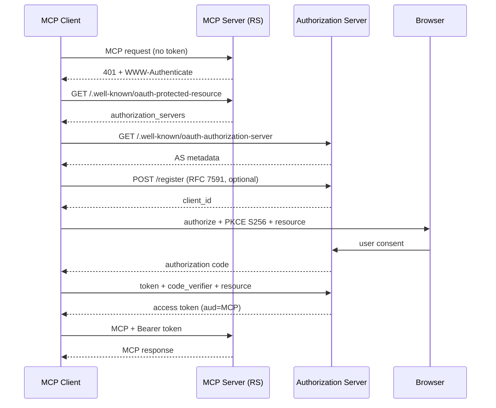

# OAuth 2.1 for MCP over Streamable HTTP

Remote MCP over Streamable HTTP uses OAuth 2.1 with mandatory PKCE (S256), Protected Resource Metadata (RFC 9728), and resource-bound tokens (RFC 8707). stdio does not use this flow — resolve credentials from the env/config chain instead.

**Sources:** [MCP Authorization](https://modelcontextprotocol.io/specification/2025-06-18/basic/authorization), [RFC 9728](https://datatracker.ietf.org/doc/html/rfc9728), [OAuth 2.1 draft](https://datatracker.ietf.org/doc/html/draft-ietf-oauth-v2-1-13)

## End-to-end flow

1. Client calls MCP without a token → server returns `401` with `WWW-Authenticate` pointing at `resource_metadata`.
2. Client GETs RFC 9728 Protected Resource Metadata (`/.well-known/oauth-protected-resource`) → learns `authorization_servers`.
3. Client GETs RFC 8414 Authorization Server metadata (`/.well-known/oauth-authorization-server`).
4. Optional: RFC 7591 Dynamic Client Registration → client_id (and secret if confidential).
5. Client generates PKCE S256 `code_verifier` / `code_challenge`, opens browser authorize URL with `resource=<canonical MCP URI>`.
6. User consents → redirect with authorization code → token request includes `code_verifier` + `resource` → RFC 8707 resource-bound access token.
7. Client retries MCP with `Authorization: Bearer <token>`; server validates audience and scopes.



## Best practices

- **Audience binding** — Always send `resource` on authorize + token requests; MCP server MUST reject tokens not issued for its canonical URI.
- **No token passthrough** — Never forward the client's bearer token to upstream APIs; obtain a separate upstream token if needed.
- **Exact redirect URIs** — Register and validate exact matches (`localhost` or HTTPS only).
- **Issuer validation** — Trust only AS entries from RS metadata; verify `iss` and JWKS before accepting tokens.
- **Short-lived tokens** — Prefer rotating refresh tokens for public clients; store tokens securely.

**Sources:** [MCP security best practices](https://modelcontextprotocol.io/specification/2025-06-18/basic/security_best_practices), [RFC 8707](https://www.rfc-editor.org/rfc/rfc8707.html)

## Troubleshooting

| Symptom | Likely cause | Fix |
| --- | --- | --- |
| `redirect_uri_mismatch` | URI not exact match | Register exact callback; no trailing-slash drift |
| Token rejected / missing audience | Missing `resource` param | Send canonical MCP URI on auth + token requests |
| Confused deputy | Proxy uses static client_id without per-user consent | Consent per dynamic client before upstream AS |
| Mix-up attack (wrong AS) | Client trusts attacker-supplied issuer | Pin AS from RS metadata; validate `iss` |
| 401 loops | Expired / wrong-aud token | Re-run PKCE flow; check clock skew + audience |
| DCR blocked | AS disables RFC 7591 | Pre-register client_id or collect credentials in UI |

## AI-tool integration matrix

| Client | Command / config |
| --- | --- |
| Claude Code | `claude mcp add --transport http <name> https://mcp.example.com/mcp` — browser OAuth on first use |
| Claude Desktop | Customize → Connectors → Add custom connector → paste MCP URL; OAuth 2.1 + PKCE handled in browser |
| Codex CLI | `codex mcp add <name> --url https://mcp.example.com/mcp` then `codex mcp login <name>` |
| Cursor | `.cursor/mcp.json`: `{ "mcpServers": { "name": { "url": "https://mcp.example.com/mcp" } } }` — auth prompt if DCR available |
| VS Code | MCP servers in user/workspace settings with `"type": "http"` / `"url"`; completes OAuth in browser |

**Sources:** [Claude Code MCP](https://code.claude.com/docs/en/mcp), [Cursor MCP](https://cursor.com/docs/mcp), [Codex MCP](https://developers.openai.com/codex)

## Cloudflare Zero Trust + workers-oauth-provider

Put Access in front of the MCP URL (or host the RS on Workers). Managed OAuth returns `401` + `WWW-Authenticate` for non-browser agents and exposes RFC 8414 discovery. Free Access tier covers up to 50 users.

```ts
import { OAuthProvider } from "@cloudflare/workers-oauth-provider";

export default new OAuthProvider({
  apiRoute: "/mcp",
  apiHandler: MyMcpWorker,
  defaultHandler: MyAuthUi,
  authorizeEndpoint: "/oauth/authorize",
  tokenEndpoint: "/oauth/token",
  clientRegistrationEndpoint: "/oauth/register",
});
```

Wire Access policy → identity provider; enable Managed OAuth on the MCP application so agents complete PKCE without scraping a login HTML page.

**Sources:** [Managed OAuth](https://developers.cloudflare.com/cloudflare-one/access-controls/applications/http-apps/managed-oauth/), [workers-oauth-provider](https://github.com/cloudflare/workers-oauth-provider), [Cloudflare Zero Trust Access](https://www.cloudflare.com/sase/products/access/)

## Free / low-cost authorization servers

| Option | Cost shape | Notes |
| --- | --- | --- |
| **Keycloak** (self-hosted) | Free OSS; you pay infra | Full OAuth 2.1, DCR, PKCE policies; best for on-prem / air-gap |
| Auth0 | Free tier (~25k MAU typical) | Managed AS; enable PKCE + Resource Indicators |
| Stytch | Free developer tier | B2B/B2C auth; confirm RFC 8707 `resource` support |
| WorkOS | Free tier for early apps | Strong MCP / enterprise SSO story |

Prefer Keycloak when you need full control; use Auth0/Stytch/WorkOS free tiers for managed AS without running IdP ops.

**Sources:** [Keycloak MCP authz](https://www.keycloak.org/securing-apps/mcp-authz-server), [WorkOS MCP auth](https://workos.com/blog/best-mcp-server-authentication-providers)

## Related

- `mcp-transports.md` — Streamable HTTP transport modes
- `auth-resolution-chain.md` — stdio / CLI credential chain (non-OAuth)
