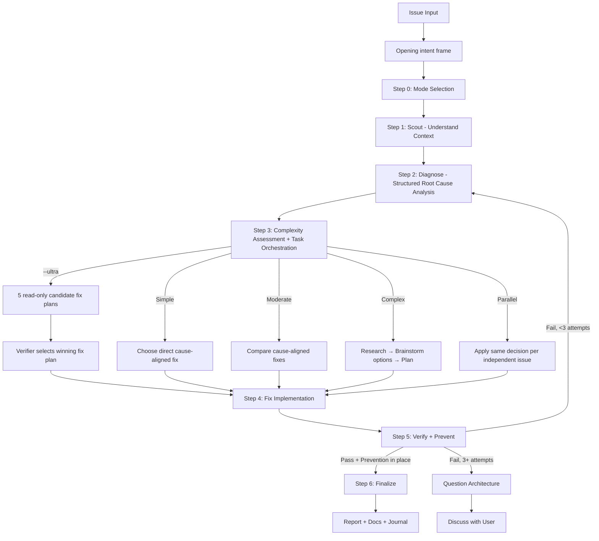

# Fixing

Unified skill for fixing issues of any complexity with intelligent routing.

## Arguments

- `--auto` - Activate autonomous mode (**default**)
- `--review` - Activate human-in-the-loop review mode
- `--quick` - Activate quick mode
- `--parallel` - Activate parallel mode: route to parallel `fullstack-developer` agents per issue
- `--advice` - Run under `kongming` advisory supervision (see Advisory supervision)
- `--ultra` - Run the post-diagnosis fix-plan selection as a best-of-5 verifier pass (see Ultra Verifier Mode); hard-conflicts with `--quick` and `--parallel`

## Advisory supervision (`--advice`)

When `--advice` is present, run this skill under `kongming` supervision.
Load `../ak-brainstorm/references/advisory-supervision.md` for supervisor
identity, host detection, and model routing (Claude subscription → Fable 5;
Codex → `gpt-5.6-sol` + high effort; Cursor → `claude-fable-5-high`).

Spawn `kongming` at these checkpoints:

- **After each phase or step completes** (Steps 1-6) — pass the goal, what
  changed, and the evidence; ask for a go/no-go and the next risk to watch.
- **When stuck** — the 3+ failed-attempt gate, a blocked step, or contradictory
  evidence; pass everything already tried and the exact obstacle before
  questioning the architecture.
- **Before a high-stakes decision** — a design fork, a public-contract or
  security-sensitive change, or an irreversible action; get counsel first.

**When the workflow reaches a PR** (e.g. a CI-failure fix shipped for review):
when handing off to a downstream skill, pass `--advice` along so supervision
persists. Watch and fix CI until every required check is green, then spawn
`kongming` to review the whole implementation and post its assessment plus
concrete next steps as a comment directly on the PR and the source issue (when
one exists).

<HARD-GATE-BRAINSTORM-FIRST>
Begin with a bounded intent frame before mode selection or diagnosis:

- **Outcome:** the expected repaired behavior.
- **Constraints:** safety, compatibility, ownership, and time boundaries.
- **Non-goals:** adjacent behavior this fix must not absorb.
- **Acceptance criteria:** the reproduction and broader evidence that will prove
  the repair complete.

Reuse these fields from an accepted plan when available. This opening gate does
not choose a fix. Scout and diagnose the root cause before comparing solution
options.
</HARD-GATE-BRAINSTORM-FIRST>

<HARD-GATE>
Do NOT propose or implement fixes before completing Steps 1-2 (Scout + Diagnose).
Symptom fixes are failure. Find the cause first through structured analysis, NEVER guessing.
If 3+ fix attempts fail, STOP and question the architecture — discuss with user before attempting more.
User override: `--quick` mode allows fast scout→diagnose→fix cycle for trivial issues (lint, type errors).
</HARD-GATE>

<HARD-GATE-SCOUT-FIRST>
After the opening intent frame, scan the codebase before forming hypotheses or
asking solution-oriented questions. Mandatory scout outputs (collect before
diagnosis):
1. Project type, language(s), framework(s) — from package.json/pyproject.toml/go.mod/etc.
2. The exact file(s) where the symptom surfaces + their direct callers/dependents
3. Related tests covering the affected area
4. Recent commits (`git log --oneline -20`) touching scouted files — possible introducer
5. Existing patterns/conventions for this kind of code (so the fix matches them)

State a concise codebase-context summary before asking for missing diagnostic
evidence.
</HARD-GATE-SCOUT-FIRST>

<HARD-GATE-EXACT-ROOT-CAUSE>
Do NOT propose a fix until you can answer ALL of these in one concrete sentence each:

1. **Exact symptom**: precise error message / failing assertion / observed behavior (copy verbatim, not paraphrased).
2. **Reproduction steps**: minimal sequence that triggers it (commands, inputs, environment).
3. **Expected vs actual**: what SHOULD happen vs what DOES happen.
4. **Root cause** (not symptom): the underlying defect — a specific line, missing check, race condition, contract violation, or design flaw. Cite file:line evidence.
5. **Why now**: what change/condition exposed it (recent commit, data shape, env, dep upgrade).
6. **Blast radius**: every code path that depends on the broken behavior or shares the same root cause.

If ANY item is vague ("probably", "I think", "something with…"), use `ask_user capability` to gather missing facts (logs, repro, env) OR run more scout/debug — never guess.

Use `ask_user capability` with options grounded in scout findings (specific files, specific commits, specific functions) — never abstract.
</HARD-GATE-EXACT-ROOT-CAUSE>

<HARD-GATE-NO-SIDE-EFFECTS>
The fix is NOT done until verified to be side-effect-free. Step 5 MUST prove:

1. Original symptom no longer reproduces (re-run exact pre-fix repro from Step 2).
2. All tests in modified files + transitively-affected modules pass.
3. No business logic / workflow regression in the **blast radius** identified above (run those tests too, or manually walk the affected flows).
4. No new lint/type/build errors introduced anywhere.
5. Public API contracts (function signatures, exported types, response shapes, DB schemas, env vars) unchanged — OR change is intentional and called out.

If verification reveals a side effect, regression, or broken workflow, STOP. Do
NOT silently patch around it. Use `ask_user capability` to present what broke,
why the fix caused it (1-line cause), and 2-4 concrete options (revert and try a
different root-cause angle; keep the fix and update dependents; narrow the fix
scope; accept the regression as buggy locked-in behavior).
</HARD-GATE-NO-SIDE-EFFECTS>

## Anti-Rationalization

| Thought | Reality |
|---------|---------|
| "I can see the problem, let me fix it" | Seeing symptoms ≠ understanding root cause. Scout first. |
| "Quick fix for now, investigate later" | "Later" never comes. Fix properly now. |
| "Just try changing X" | Random fixes waste time and create new bugs. Diagnose first. |
| "It's probably X" | "Probably" = guessing. Use structured diagnosis. Verify first. |
| "One more fix attempt" (after 2+) | 3+ failures = wrong approach. Question architecture. |
| "Emergency, no time for process" | Systematic diagnosis is FASTER than guess-and-check. |
| "I already know the codebase" | Knowledge decays. Scout to verify assumptions before acting. |
| "The fix is done, tests pass" | Without prevention, same bug class will recur. Add guards. |

## Process Flow (Authoritative)



**This diagram is the authoritative workflow.** If prose conflicts with this flow, follow the diagram.

## Workflow

### Step 0: Intent Frame & Mode Selection

First capture or reuse the opening outcome, constraints, non-goals, and
acceptance criteria. If the mode is neither explicit nor safely inferable, use
`ask_user capability` to choose it:

| Option | Recommend When | Behavior |
|--------|----------------|----------|
| **Autonomous** (default) | Simple/moderate issues | Auto-approve if score >= 9.5 & 0 critical |
| **Human-in-the-loop Review** | Critical/production code | Pause for approval at each step |
| **Quick** | Type errors, lint, trivial bugs | Fast scout → diagnose → fix → review cycle |

See `references/mode-selection.md` for ask_user capability format.

### Step 1: Scout (MANDATORY — never skip)

**Purpose:** Understand the affected codebase BEFORE forming any hypotheses.

**Mandatory skill chain:**
1. Activate `ak:scout` skill OR launch 2-3 parallel `Explore` subagents
2. Discover: affected files, dependencies, related tests, recent changes (`git log`)
3. Read `./docs` for project context if unfamiliar

**Quick mode:** Minimal scout — locate affected file(s) and their direct dependencies only.
**Standard/Deep mode:** Full scout — map module boundaries, test coverage, call chains.

**Output:** `✓ Step 1: Scouted - [N] files mapped, [M] dependencies, [K] tests found`

### Step 2: Diagnose (MANDATORY — never skip)

**Purpose:** Structured root cause analysis. NO guessing. Evidence-based only.

**Mandatory skill chain:**
1. **Capture pre-fix state:** Record exact error messages, failing test output, stack traces, log snippets. This becomes the baseline for Step 5 verification.
2. Activate `ak:debug` skill (systematic-debugging + root-cause-tracing techniques).
3. Activate `ak:sequential-thinking` skill — form hypotheses through structured reasoning, NOT guessing.
4. Spawn parallel `Explore` subagents to test each hypothesis against codebase evidence.
5. If 2+ hypotheses fail → auto-activate `ak:problem-solving` skill for alternative approaches.
6. Create diagnosis report: confirmed root cause, evidence chain, affected scope.

Use the root-cause checklist above as the authoritative diagnosis protocol.

**Output:** `✓ Step 2: Diagnosed - Root cause: [summary], Evidence: [brief], Scope: [N files]`

### Step 3: Complexity Assessment & Progress Orchestration

Classify before routing. See `references/complexity-assessment.md`.

| Level | Indicators | Workflow |
|-------|------------|----------|
| **Simple** | Single file, clear error, type/lint | `references/workflow-quick.md` |
| **Moderate** | Multi-file, root cause unclear | `references/workflow-standard.md` |
| **Complex** | System-wide, architecture impact | `references/workflow-deep.md` |
| **Parallel** | 2+ independent issues OR `--parallel` flag | Parallel `fullstack-developer` agents |

**Progress orchestration (Moderate+ only):** After classifying, record all phases and their dependencies upfront.
- Skip for Quick workflow (< 3 steps, overhead exceeds benefit)
- Discover the live task-management surface and use it when available
- Otherwise, update the active plan as each phase starts or completes
- For Parallel: keep separate dependency trees and ownership per independent issue
- Plan files are the durable source of truth; runtime tracking must never be required for the fix to proceed

Select a solution only from the confirmed diagnosis:

- For one safe, direct repair, record why it satisfies the opening contract.
- For multiple viable repairs or an architecture decision, activate
  `ak:brainstorm`, compare trade-offs, and resolve the direction before
  implementation.
- Deep workflow always includes this post-diagnosis solution brainstorm and a
  plan. Quick and Standard escalate to Deep when the choice is not direct.

### Step 4: Fix Implementation

- Implement the fix per selected workflow, updating progress as phases complete.
- Follow diagnosis findings — fix the ROOT CAUSE, not symptoms.
- Minimal changes only. Follow existing patterns.
- Preserve the opening non-goals and constraints; do not widen the fix while
  addressing nearby symptoms.

### Step 5: Verify + Prevent (MANDATORY — never skip)

**Purpose:** Prove the fix works, has NO side effects, and prevents the same bug class from recurring. See HARD-GATE-NO-SIDE-EFFECTS.

**Mandatory skill chain:**
1. **Verify (iron-law):** Run the EXACT commands from pre-fix state capture. Compare output. NO claims without fresh evidence.
2. **Regression test:** Add or update test(s) that specifically cover the fixed issue. The test MUST fail without the fix and pass with it.
3. **Side-effect sweep (NEW):** Run tests across the full **blast radius** identified in Step 2 (not just the modified file). Walk each dependent code path. Confirm public contracts unchanged (signatures, response shapes, DB schemas, env vars).
4. **Code review (delegate):** Spawn `code-reviewer` subagent with explicit instructions to check: (a) root cause actually addressed (not symptom-patched), (b) no broken business logic in blast radius, (c) no new failure modes, (d) follows existing patterns from scout. Pass scout summary + diagnosis report as context.
5. **Prevention gate:** Apply defense-in-depth validation where applicable.
6. **Parallel verification:** Launch `run_shell capability` agents for typecheck + lint + build + test.

**If verification fails OR a side effect is detected:** Use `ask_user capability` per HARD-GATE-NO-SIDE-EFFECTS — present what broke, why, and 2-4 concrete options (revert, narrow scope, update dependents, accept). Never silently patch.

**If verification fails:** Loop back to Step 2 (re-diagnose). After 3 failures → question architecture, discuss with user.

Use the verification checklist above for prevention requirements.

**Output:** `✓ Step 5: Verified + Prevented - [before/after comparison], [N] tests added, [M] guards added`

### Step 6: Finalize (MANDATORY — never skip)

1. Report summary: confidence score, root cause, changes, files, prevention measures, side-effect sweep results
2. **Activate `the engineer project-management skill` skill (MANDATORY)** → sync plan status (if the fix is part of a plan), update progress, refresh runtime tracking when available, generate status report
3. Evaluate docs impact; use `docs-manager` only when a routed authority surface changed
4. Reflect completion in the live task-management surface when available
5. Ask user if they want to commit via `git-manager` subagent
6. Run `/ak:journal` to write a concise technical journal entry upon completion — unless the shared "Journal step — opt-out" below applies.

### Journal step — opt-out

Skip the automatic `/ak:journal` step when either applies:
- The invocation includes the `--skip-journal` flag, OR
- `ak config prefs resolve --json | jq -r 'if .prefs.journal.auto == false then "false" else "true" end'` returns `false`. If the command errors or prints anything other than the exact string `false`, treat as `true` (default) — corrupt or missing config never suppresses the automatic journal.

Precedence: flag > project config > user config > default (`true`).
When skipped, print one line:
- `journal skipped by --skip-journal` (flag), or
- `journal skipped by preference` (config).

Explicit `/ak:journal` and `ak journal create` are unaffected. The rest of the Finalize block above stays MANDATORY.

---

## Ultra Verifier Mode (`--ultra`)

When `--ultra` is present, run Steps 0-2 once — the confirmed diagnosis joins
one immutable evidence packet — then fan ONLY the Step 3 solution selection and
fix-plan generation to exactly five independent read-only candidates in one
parallel wave; a single strongest-model verifier scores them.

- **Candidate task:** each candidate produces a complete fix plan — chosen
  repair, files to touch, ordered changes, risk notes, and verification steps —
  grounded in the confirmed diagnosis. Candidates never re-derive the confirmed
  root cause and never edit files.
- **Rubric:** cause-alignment (fixes the root cause, not the symptom), blast-
  radius safety, minimality, and verifiability of the plan's acceptance steps.
- **Finalizer:** the verifier selects the single winning fix plan unchanged (or
  rejects all); Steps 4-6 execute once from the winner. On reject-all,
  hard-stop and report why.

`--ultra` hard-conflicts with `--quick` and `--parallel` (quick skips the
deliberation ultra exists for; parallel owns the multi-agent strategy) — on
either combination, hard-stop and ask. Full mechanics are in
`../ak-brainstorm/references/ultra-verifier-mode.md`. It is a best-of-5
verifier mode inspired by LLM-as-a-Verifier, not the full framework.

## IMPORTANT: Skill/Subagent Activation Matrix

See `references/skill-activation-matrix.md` for the complete matrix: always-on
activations (`ak:scout` Step 1, `ak:debug` + `ak:sequential-thinking` Step 2,
`ak:project-management` Step 6), conditional triggers (`ak:problem-solving`
after 2+ failed hypotheses, `ak:brainstorm` for multi-approach decisions,
`ak:context-engineering` for AI/LLM code), and the subagent/parallel roster.

## Output Format

Unified step markers:
```
✓ Step 0: Intent framed; [Mode] selected
✓ Step 1: Scouted - [N] files, [M] deps
✓ Step 2: Diagnosed - Root cause: [summary]
✓ Step 3: [Complexity] detected - [workflow] selected
✓ Step 4: Fixed - [N] files changed
✓ Step 5: Verified + Prevented - [tests added], [guards added]
✓ Step 6: Complete - [action taken]
```

## References

Load as needed:
- `references/mode-selection.md` - ask_user capability format for mode
- `references/complexity-assessment.md` - Classification criteria
- `references/workflow-quick.md` - Quick: scout → diagnose → fix → verify+prevent → review
- `references/workflow-standard.md` - Standard: full pipeline with Tasks
- `references/workflow-deep.md` - Deep: research + brainstorm + plan with Tasks
- `references/review-cycle.md` - Review logic (autonomous vs HITL)
- `references/skill-activation-matrix.md` - When to activate each skill
- `references/parallel-exploration.md` - Parallel Explore/run_shell capability/Task coordination patterns

**Specialized Workflows:**
- `references/workflow-ci.md` - GitHub Actions/CI failures
- `references/workflow-logs.md` - Application log analysis
- `references/workflow-test.md` - Test suite failures
- `references/workflow-types.md` - TypeScript type errors
- `references/workflow-ui.md` - Visual/UI issues (requires design skills)

## Workflow Position

**Typically starts from:** a concrete bug or failure; it captures intent before
scouting and diagnosis.
**Typically precedes:** `ak-test` (validate the fix)
**Related:** `/ak:cook` (alternative for feature work), `the engineer debug skill` (diagnose before fixing), `the installed code-review skill` (review the fix, engineer tier)
