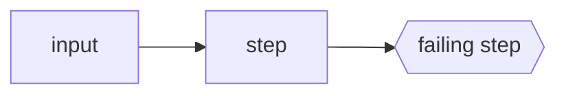

<!-- Fill every placeholder with evidence; delete sections that do not apply.
     Translate prose to the resolved writing language. -->

## Summary

<!-- One paragraph: what breaks, where, impact. Readable in 10 seconds. -->

## Current behavior

<!-- What actually happens, with evidence: file:line anchors, exact error
     output, run URL, or screenshot. -->

## Expected behavior

<!-- What should happen instead, and why (link to spec/doc if one exists). -->

## Reproduction

1. <!-- exact steps / commands -->
2. …

**Conditions**: <!-- version/commit SHA, OS, config, feature flags required -->

## Flow

<!-- Only when the failure path is non-trivial. Small Mermaid diagram of the
     broken flow; mark the failing step. -->

## Evidence

- Affected code: `path/to/file.ext:line`
- Introduced by: <!-- commit SHA / PR link, from git log/pickaxe, if known -->
- Related: <!-- linked issues/PRs; branches already carrying a partial fix -->

## Open questions

- <!-- decisions needed from maintainers; delete if none -->

## Notes

- <!-- pitfalls, workarounds, scope limits -->
