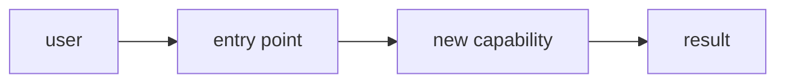

<!-- Fill every placeholder with evidence; delete sections that do not apply.
     Translate prose to the resolved writing language. -->

## Summary

<!-- One paragraph: the capability, who needs it, the value. -->

## Problem / motivation

<!-- The gap today, grounded in code or user evidence (file:line, linked
     issue, support thread). -->

## Proposed flow

<!-- How it should work end-to-end. Diagram when more than 2–3 steps. -->

## Scope

**In scope**
- <!-- concrete deliverables -->

**Out of scope / non-goals**
- <!-- explicitly excluded, to prevent scope creep -->

## Acceptance criteria

- [ ] <!-- verifiable outcome 1 -->
- [ ] <!-- verifiable outcome 2 -->

## Conditions & constraints

- <!-- compatibility, performance, security, affected public contracts -->

## Touchpoints

- <!-- files/modules likely involved, from the scout pass: path:line -->

## Open questions

- <!-- decisions needed before implementation; delete if none -->

## Notes

- <!-- alternatives considered, related issues/PRs -->
